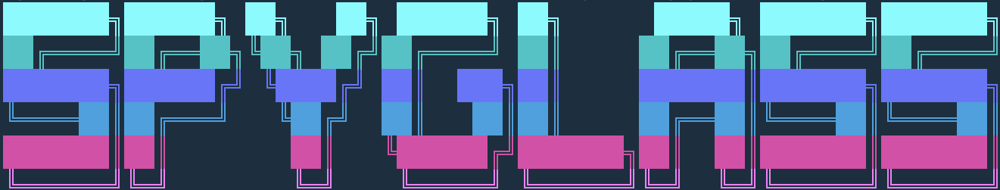

# Spyglass CLI



Spyglass - access management for data teams.

## Overview

Basic usage of this tool looks like:

1. Import your current Snowflake objects/roles to YAML.
2. Manage them as code.
3. Automatically sync objects/roles between your Git repo and Snowflake.

```
┌───────────┐                        ┌──────────┐
│           │     import / sync      │          │
│ Snowflake │ ─────────────────────► │   YAML   │
│           │                        │          │
└───────────┘                        └──────────┘

┌───────────┐                        ┌──────────┐
│           │     make changes       │          │
│           │ ─────────────────────► │          │
│ Data Eng  │                        │   YAML   │
│           │        verify          │          │
│           │ ─────────────────────► │          │
└───────────┘                        └──────────┘

┌───────────┐                        ┌──────────┐
│           │        apply           │          │
│ Snowflake │ ◄───────────────────── │   YAML   │
│           │                        │          │
└───────────┘                        └──────────┘
```

## Getting Started

Install the CLI using `npm`:

```
npm install -g spyglass-cli
```

## Basic Usage

See [How do I set up the CLI? #43](https://github.com/spyglasshq/spyglass-cli/discussions/43)

## CI/CD Usage

See [How do I set up github actions / workflows? #42](https://github.com/spyglasshq/spyglass-cli/discussions/42).

## Getting Help and Contributing

We love working with the community, here's a few ways to get involved:

1. [Discussions](https://github.com/spyglasshq/spyglass-cli/discussions) - For FAQs, Q&A, feature requests, ideas, announcements, and sharing your use cases.
2. [Issues](https://github.com/spyglasshq/spyglass-cli/issues) - For bug reports and concrete work items.
3. [Email](mailto:devs@spyglass.software) - If all else fails, or if you'd just like to chat, let us know at devs@spyglass.software.
4. [Slack](mailto:demo@spyglass.software) - For early partners, we're working on Slack for real time feedback and support. If you're interested, reach out to demo@spyglass.software.

## Security

See [SECURITY.md](./SECURITY.md)

## Usage Analytics

We constantly improve this software, but we need your help!

By default, we log **anonymous analytics** such as: which commands are invoked, what errors are encountered, and contextual data such as OS/node/CLI version. See https://github.com/spyglasshq/spyglass-cli/issues/9 and [logging.ts](./src/lib/logging.ts) for more information.

This data is correlated by a unique, anonymous `analyticsId`, which can't be used to derive any personally-identifiable user information.

To opt out, you can run `spyglass config:set disableAnalytics true`.
